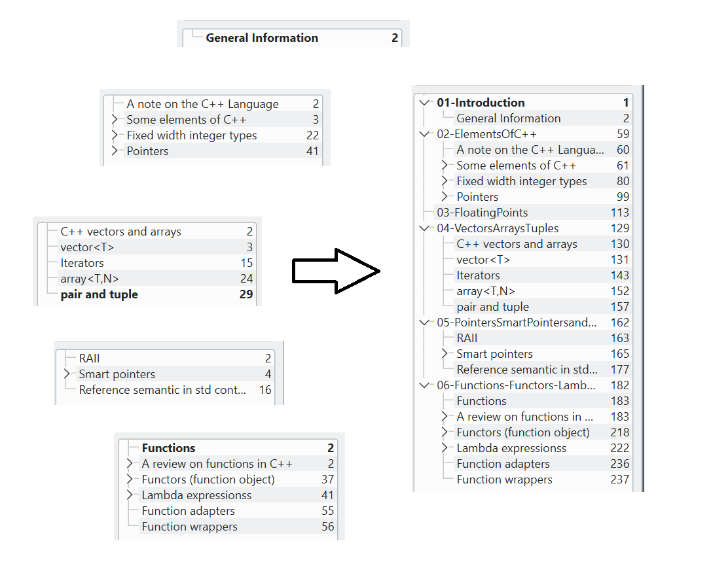

# merge-pdf-with-toc
Merge more pdf files into one, preserving the toc (table of contents) of all of them (ie merging also that).

## Usage
In your current folder you should have all the pdf you want to merge, and the "script" folder pdftoc. Then call `bash pdftoc/pdf_and_toc.sh` to execute the main script. At the end there will be a `out.pdf` (or whatever name you choose) file with the result.

For each pdf in the current folder, it will be asked if you want to include them in the merging process.

If yes, it asks if you want to add a chapter with the current pdf name as title (like to say "here starts the current pdf content").
If you answer yes to this, it then asks how you want to add the chapters of the current pdf: as sub-chapters of the "pdf file" chapter, or as single ones, indipendent of the pdf out of which they came from.

For each pdf, you can answer "y/n" to each individual question or "a" for saying yes to all the questions.

## Technical comments and Requirements
- The library *jpdfbookmarks* is used, so *java* is required in order to run it
- The merging of the pdf is done by the command *pdfunite*, which is installable on ubuntu through the package *poppler-utils* (sudo apt install it)
- For the pdf handling also the package *exiftool* is required, and it is installable as before through the package *libimage-exiftool-perl*
- The other script `pdftoc/fix_toc_txt.sh` finalizes the computation of the pages

## Example
Here there is a small example of the result, using the pdfs in the Test folder, where we can see how the single toc of each pdf ended also here, correctly shifted, into the final document.



## Run of the example
```
include 01-Introduction.pdf? a
include 02-ElementsOfC++.pdf? a
include 03-FloatingPoints.pdf? y
  > bookmark also the file? y
  > add file chapters as sub-chapters? y
include 04-VectorsArraysTuples.pdf? a
include 05-PointersSmartPointersandReferences.pdf? a
include 06-Functions-Functors-Lambdas.pdf? a

Merging the pdfs... it may require some time...
Fixing bookmarks...
Importing them...
done!

How to call the final pdf? Lectures
```
