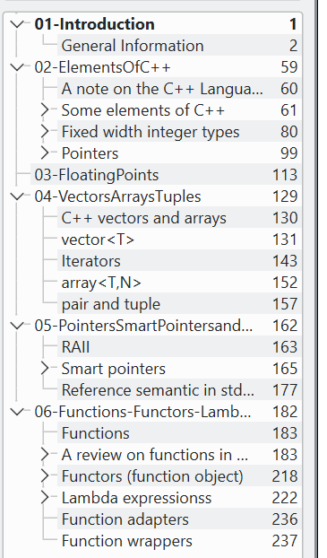

# merge-pdf-with-toc
Merge more pdf files into one, preserving the toc (table of contents) of all of them (ie merging also that).

## Usage
Bring all the pdfs into this current folder, then execute the script `pdf_and_toc.sh` (make sure that the folder of jpdfbookmarks is in the same directory of the script). At the end there will be a `out.pdf` (or whichever name you choose) file with the result.

## Technical comments and Requirements
- The library *jpdfbookmarks* is used, so *java* is required in order to run it
- The merging of the pdf is done by the command *pdfunite*, which is installable on ubuntu through the package *poppler-utils* (sudo apt install it)
- For the pdf handling also the package *exiftool* is required, and it is installable as before through the package *libimage-exiftool-perl*
- The other script `fix_toc_txt.sh` finalizes the computation of the pages 

## Example
Here there is a small example of the result, using the pdfs in the Test folder, where we can see how the single toc of each pdf ended also here, correctly shifted, into the final document.

